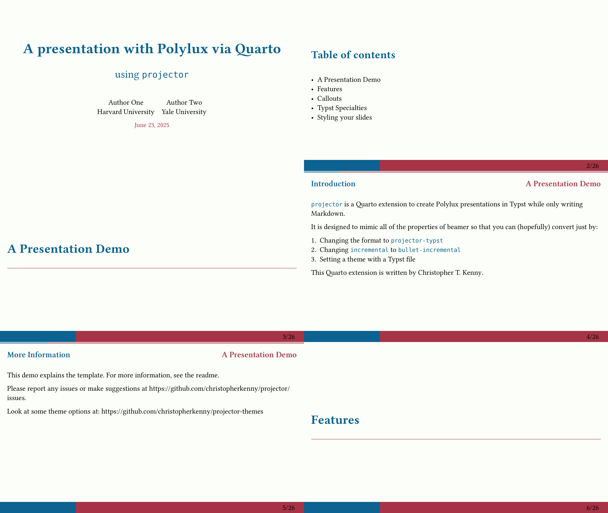

# `university` theme for `projector`

This is a simple, but professional theme derived the old university theme from [`polylux-typ/polylux`](https://github.com/polylux-typ/polylux).

<!-- Edit this to indicate what it does-->
This theme provides a custom title slide, featuring author names and institutions.
TOC and section slides are horizontally centered and feature unnumbered details.
Each slide has a small progress bar across the top margin.

## License

This theme is licensed under the MIT License, as it is adapted from [`polylux-typ/polylux`](https://github.com/polylux-typ/polylux), which is under the MIT License by Andreas Kröpelin.
